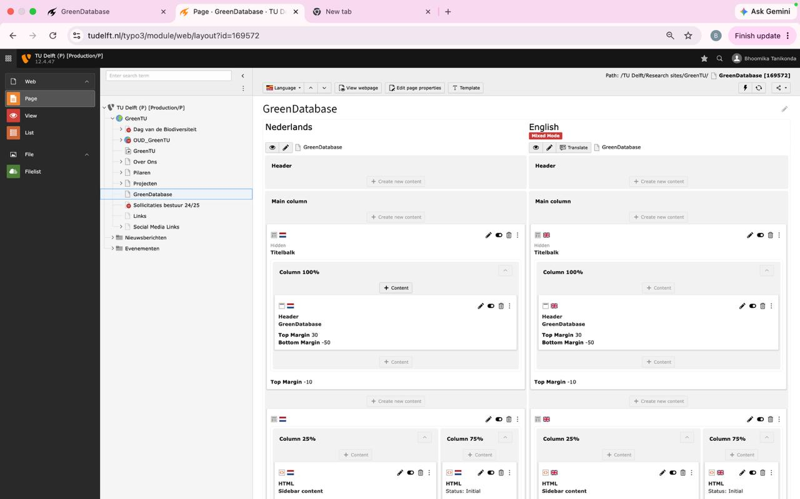
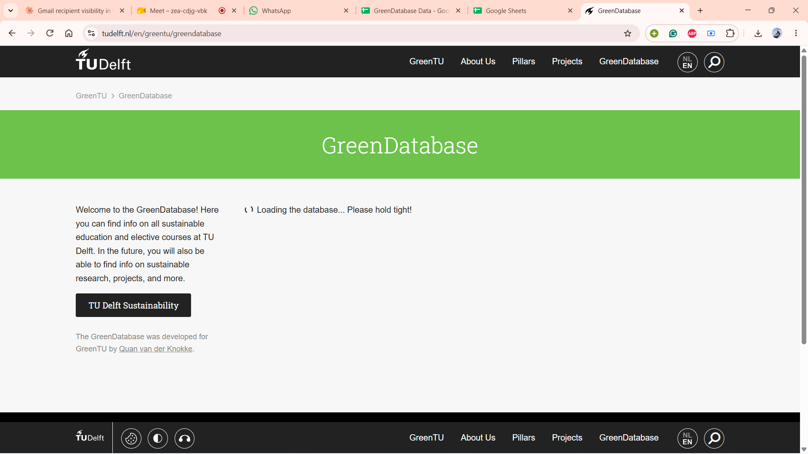
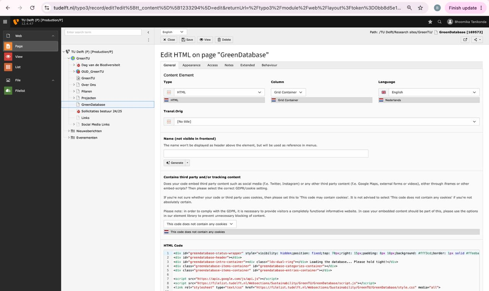
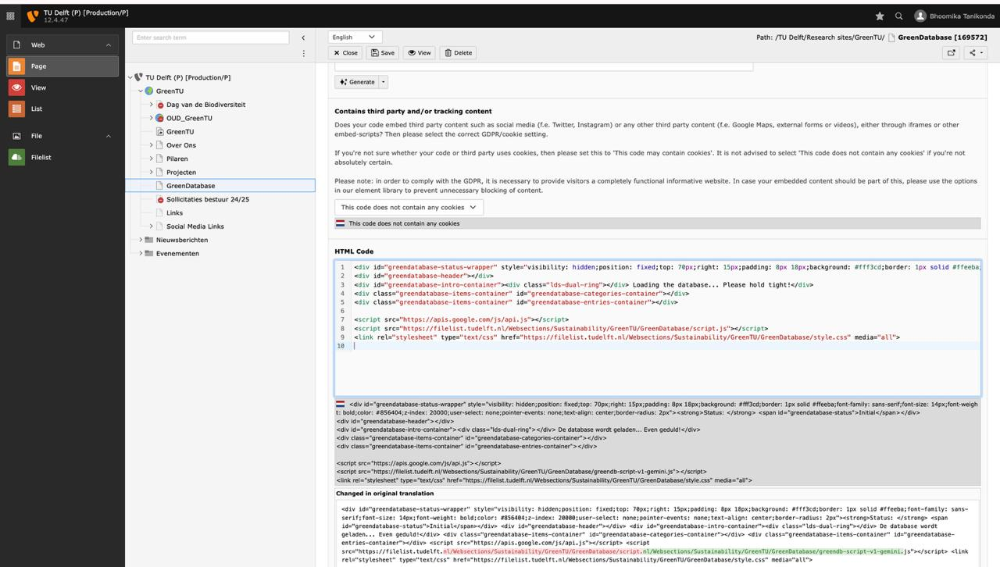
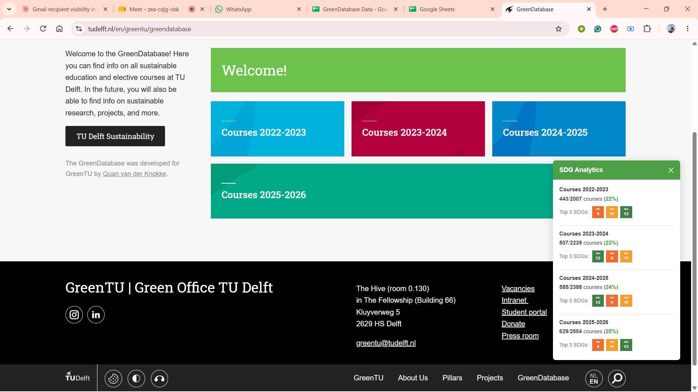

# GreenTU Handover

This is the combined handover doc for the GreenTU project: how the yearly course ratings are produced (`studyguide/`) and how they end up on the live GreenDatabase webpage (`webpage/`). The two halves also exist as standalone files — [studyguide/HANDOVER.md](studyguide/HANDOVER.md) and [webpage/HANDOVER.md](webpage/HANDOVER.md).

---

## Part 1 — Studyguide: producing the ratings

Courses for 22-23, 23-24, 24-25, and 25-26 are rated in this repository.
22-23 already had manual ratings from the previous GreenDatabase. 23-24 and 24-25 were previously rated using the OpenAI API. 25-26 had no prior ratings at all — both the manual rating and the OpenAI rating were done fresh this year.

The goal across all these years is to end up with accurate ratings — manual ratings can be wrong due to human error, and AI ratings can be wrong too, especially from older models that are more prone to hallucinating.

Each year's course-guide PDFs are in the respective `<year>/pdfs/` folder (22-23, 23-24, 24-25). We first use `pdf_scrape.py` to extract the course details from those PDFs and write `<year>/csvs/tudelft_courses_<year>_from_pdfs.csv`, e.g.:

```bash
python pdf_scrape.py 22-23
```

which writes `studyguide/22-23/csvs/tudelft_courses_22-23_from_pdfs.csv`.

Once the course details are present, we run `sdg_rating.py` to generate the OpenAI ratings:

```bash
python sdg_rating.py --input 22-23/csvs/tudelft_courses_22-23_from_pdfs.csv --output 22-23/csvs/tudelft_courses_22-23_sdg.csv
```

This sends each course's description and learning objectives to the model, along with a fixed prompt listing all 17 SDGs, and asks it to return true/false for each one. Default model is `gpt-4o-mini`.

**To change the model:** pass `--model gpt-4o` (or any other chat model). More accurate, but more expensive per course.

**To change the prompt:** it's not a config value, it's hardcoded in `sdg_rating.py` — `SYSTEM_PROMPT` (top of the file, ~line 59) sets the classifier's instructions, and `build_user_prompt()` (~line 76) builds the per-course prompt that lists the SDG definitions and course text. Edit either directly if the ratings need to be stricter/looser or the SDG descriptions need updating.

**About the API key:** the script reads it from `openai_api_key.txt` in the `studyguide/` folder by default (or the `OPENAI_API_KEY` environment variable). The key currently in that file is mine — whoever takes this over should generate their own OpenAI API key and replace it, since usage is billed to whoever owns the key. `openai_api_key.txt` should never be committed to git.

For 25-26, the course webpage (https://studiegids.tudelft.nl) is live, so there's no PDF to parse — we scrape it directly with a real (visible) browser window instead:

```bash
python scrape_tudelft.py
```

This uses Playwright to open Chromium and walk the live study guide, writing `25-26/csvs/tudelft_courses_25-26_scraped.csv`. I have also manually rated all of these courses earlier (per faculty, in `25-26/Manual_ratings/`).

Now that each year has (or will have) two sets of ratings:

| Year | Rating set 1 | Rating set 2 |
|------|---------------|----------------|
| 22-23 | Old, manual, from the previous GreenDatabase — `22-23/csvs/DB-22-23.csv` | Generated with `sdg_rating.py` — `22-23/csvs/tudelft_courses_22-23_sdg.csv` |
| 23-24 | Old, AI-generated, from the previous GreenDatabase (not currently in this repo) | Freshly generated with `pdf_scrape.py` + `sdg_rating.py` (the resulting CSV isn't currently in this repo, only the source PDFs in `23-24/pdfs/`) |
| 24-25 | Old, AI-generated, from the previous GreenDatabase (not currently in this repo) | Freshly generated with `pdf_scrape.py` + `sdg_rating.py` (the resulting CSV isn't currently in this repo, only the source PDFs in `24-25/pdfs/`) |
| 25-26 | New, done this year — `25-26/Manual_ratings/<faculty>.csv` | Generated with `scrape_tudelft.py` + `sdg_rating.py` — `25-26/csvs/tudelft_courses_25-26_sdg.csv` |

We use `compile_comparison.py` (a separate copy per year, since 22-23 reads from one merged manual CSV while 25-26 reads from a folder of per-faculty CSVs) to line up the two rating sets by course code and colour-code each course:

- **GREEN** — ChatGPT and manual agree
- **ORANGE** — both rated it, but disagree on which SDGs
- **RED** — only ChatGPT rated it
- **BROWN** — only the manual rating has it

```bash
cd 22-23 && python compile_comparison.py   # -> csvs/comparison_22-23.csv
cd 25-26 && python compile_comparison.py   # -> csvs/25-26_comparison.csv
```

RED and BROWN rows don't need much work — only one source rated the course, so that rating is simply taken as-is. The real work is the ORANGE rows: both sources rated the course but disagree on the SDGs, so I go through those course by course and manually decide which SDGs are actually correct. That produces the final SDG ratings, which get pasted into the "DB Courses" tab of the Google Sheet that the GreenDatabase webpage reads live from (see [Part 2's "Updating the published SDG ratings"](#updating-the-published-sdg-ratings) for the exact sheet layout it expects, and `convert_sdg_format.py` in `studyguide/` if the SDGs still need converting from separate boolean columns into the single `[3, 13]`-style JSON list column the sheet uses).

---

## Part 2 — Webpage: publishing the ratings

This explains how the GreenDatabase webpage (https://www.tudelft.nl/en/greentu/greendatabase) works, how to update the published SDG ratings, and how the SDG analytics panel was added.

The GreenTU webpage (https://www.tudelft.nl/en/greentu/greendatabase), its html, css and javascript come from Typo3. The main page's html is located on the GreenDatabase page, under the GreenTU section in Typo3 ([Figure 1](#figure-1)). There is separate html for Dutch and English, and both can be edited. This static html only populates the sidebar and the loading text, as seen in [Figure 2](#figure-2).

<a id="figure-1"></a>


*Figure 1: The GreenDatabase page in the GreenTU section of the Typo3 page tree.*

<a id="figure-2"></a>


*Figure 2: The sidebar text and loading message, both populated by the static html.*

When you click on the HTML content element under GreenDatabase, it opens an editor with the actual HTML code ([Figure 3](#figure-3) and [Figure 4](#figure-4)). In there you can see two lines pointing to the files that do all the work:

```
<script src="https://filelist.tudelft.nl/Websections/Sustainability/GreenTU/GreenDatabase/script.js"></script>
<link rel="stylesheet" type="text/css" href="https://filelist.tudelft.nl/Websections/Sustainability/GreenTU/GreenDatabase/style.css" media="all">
```

<a id="figure-3"></a>


*Figure 3: The HTML content editor, showing the links to script.js and style.css.*

<a id="figure-4"></a>


*Figure 4: The same editor, showing the translated (Dutch) version of the HTML.*

So script.js and style.css are not pasted into the HTML itself, they live as separate files under Filelist (left sidebar in Typo3) and are just linked from there. To update the live page, you upload a new version of script.js/style.css to that same Filelist location, overwriting the old one. Note: in the Dutch translation the deployed file is sometimes named something else (e.g. greendb-script-v1-gemini.js) instead of script.js, so double check both language versions point to the file you actually updated.

The javascript and css populate the webpage with the dynamic sdg rating content for years 22-23, 23-24, 24-25, 25-26, and also the analytics panel. Once everything has loaded, the webpage looks like [Figure 5](#figure-5).

<a id="figure-5"></a>


*Figure 5: The GreenDatabase page once the categories and analytics panel have loaded.*

### What script.js does, and the main things you'd ever change

- **`spreadsheetId`** (top of the file) — the ID of the Google Sheet that the whole database is read from. If the data ever moves to a different sheet, this is the one line you update. See [webpage/README.md's "Key setting to know"](webpage/README.md#key-setting-to-know).
- **Main starting function** — the file ends with `gapi.load('client', loadApi)`. That's the entry point: it loads Google's API client, which calls `loadApi`, which authenticates and then calls `initializeDatabase`. That function reads every worksheet starting with "DB " and builds the category cards you see on the home screen.
- **Analytics starting function** — `updateHomeAnalytics()` fills in the panel on the home screen (stats across all categories), and `updateAnalytics()` fills it in once you're inside a category (stats for what's currently filtered/visible). Both just read from the same data `initializeDatabase` already loaded, so you don't need to fetch anything again to change what the panel shows.

### What happens when you click a year (a category card)

Each card on the home screen (e.g. "22-23", "23-24") corresponds to one worksheet in the Google Sheet, named "DB \<something\>". Clicking a card calls `loadCategory(worksheetTitle)`, which:

1. Updates the page URL to include `?category=...`, so the specific year can be linked to directly and reopened straight to that view.
2. Hides the home screen's category cards and calls `loadAndRenderCategory` to fetch that worksheet's rows and turn them into course cards.
3. Calls `initializeFilters()` and `initializeSorting()` to build the sidebar filter checkboxes (SDGs, faculty/programme, etc.) and the sort dropdown for that specific category.
4. Shows the entries and hides the welcome text.
5. Opens the SDG Analytics panel and calls `updateAnalytics()`, so the stats immediately reflect this year analytics rather than the whole database.

From there, using the search box, filters, or sorting doesn't reload anything from Google Sheets, it just re-filters the cards already loaded in the browser and calls `updateAnalytics()` again so the panel stays in sync with what's visible.

### What style.css does

Mostly just visual: card layout, spacing, the SDG colour blocks (one CSS class per SDG number, 1 through 17), and the analytics panel's position, size and colours. If something on the page looks wrong (colour, spacing, panel in the wrong place) it's almost always in here, not in script.js. [webpage/README.md's "Common tweaks"](webpage/README.md#common-tweaks) has ready-made snippets for the changes people ask for most (SDG colours, panel position/colour, cards per row, welcome text, faculty translations).

### Updating the published SDG ratings

This page does not rate anything itself, it only displays whatever is in the Google Sheet. To actually change which courses show up (new year, corrected rating, etc.), you don't touch script.js or style.css at all — you run the pipeline in [Part 1](#part-1--studyguide-producing-the-ratings) and update the Google Sheet's "DB Courses" tab with the result. The webpage will pick up the change automatically next time someone loads it, since it always reads live from the sheet.

If you're editing the sheet directly, each category worksheet (tab name must start with `DB `) has a fixed layout the script expects:

| Row | Content |
|-----|---------|
| B2 | Category title — bilingual: `English///Dutch` |
| B3 | Category description — bilingual |
| B4 | Colour name (e.g. `green`) |
| B5 | Visible on home screen? (`Yes` / `No`) |
| B7–B11 | Column definitions (one per column): name, show (TRUE/FALSE), field type, filterable (TRUE/FALSE), sortable (TRUE/FALSE) |
| Row 12+ | Actual data rows. Column A = `TRUE` (visible) or `FALSE` (hidden) |

**Field types** recognised by the script:

| Type | What it does |
|------|--------------|
| `title` | Shown as the card heading |
| `subtitle` | Shown as the card sub-heading |
| `link` | Makes the card clickable (URL) |
| `sdgs` | A JSON list of SDG numbers, e.g. `[3, 13]` — renders coloured SDG blocks |
| `text` | A labelled text field shown inside the card |
| `boolean` | Shown as Yes/No |
| `description` | Longer text field |
